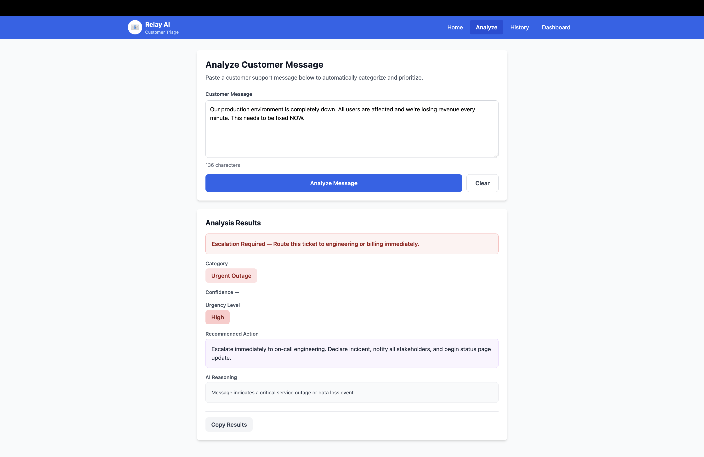
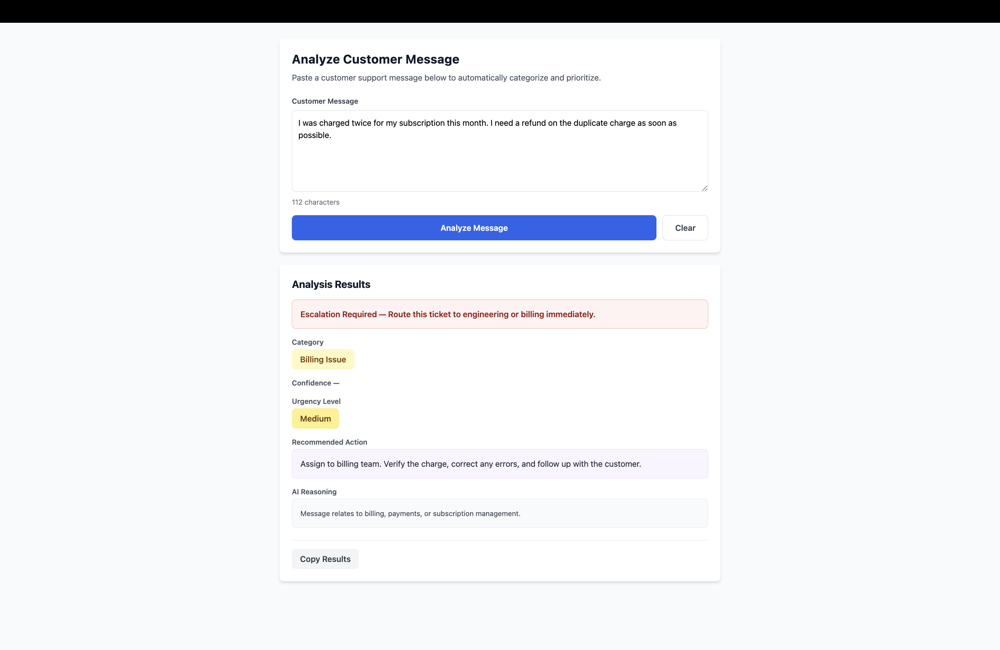
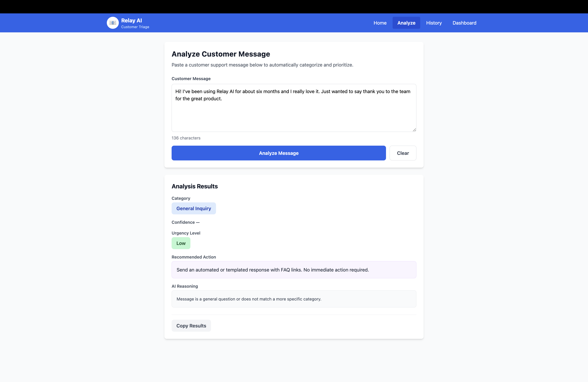

# Customer Inbox Triage — Relay AI

A lightweight AI-powered tool that helps support teams classify, prioritize, and route inbound customer messages. Built with React + Vite, Tailwind CSS, and the Groq API (Llama 3.3 70B).

---

## What It Does

Paste any customer support message and the app runs a three-step pipeline:

1. **Category Classification (LLM)** — Calls Groq's Llama 3.3 70B to classify the message into one of five categories
2. **Urgency Scoring (Rule-based)** — Applies a deterministic scoring algorithm to assign High / Medium / Low urgency
3. **Recommendation + Escalation (Template-based)** — Maps the category × urgency pair to a recommended action, and flags whether the ticket requires immediate escalation

Results are displayed in the UI and saved to `localStorage` for review in the History and Dashboard tabs.

### The Five Categories

| Category | When It Applies |
|---|---|
| Urgent Outage | Production down, data loss, security breach, full service unavailable |
| Technical Problem | Bugs, errors, crashes, features not working, performance issues |
| Billing Issue | Payments, charges, invoices, refunds, subscription changes |
| Feature Request | Suggestions for new functionality or improvements |
| General Inquiry | Questions, info requests, account questions, positive feedback |

### Escalation Logic

A ticket is flagged for escalation if **any** of these are true:
- Urgency is **High** (any category)
- Category is **Urgent Outage** (any urgency)
- Category is **Billing Issue** AND urgency is **Medium**

---

## Screenshots

### Urgent Outage — High Urgency — Escalation Required
> "Our production environment is completely down. All users are affected and we're losing revenue every minute. This needs to be fixed NOW."



---

### Billing Issue — Medium Urgency — Escalation Required
> "I was charged twice for my subscription this month. I need a refund on the duplicate charge as soon as possible."



---

### General Inquiry — Low Urgency — No Escalation
> "Hi! I've been using Relay AI for about six months and I really love it. Just wanted to say thank you to the team for the great product."



---

## Bug Fixes Applied (Assessment Context)

This project was delivered with 16 intentional bugs across the three core utility files and the main UI page. Below is a full account of what was wrong and how each issue was corrected.

---

### `src/utils/llmHelper.js`

| # | Bug | Fix |
|---|---|---|
| 1 | System prompt listed 6 wrong categories (`"Complaint"`, `"Critical Escalation"`) | Rewrote prompt to list exactly the 5 valid spec categories |
| 2 | Prompt did not ask for a `confidence` score | Added `confidence` (0–100 integer) to the required JSON shape |
| 3 | `temperature: 0.3` — produces non-deterministic results | Changed to `temperature: 0.1` per spec |
| 4 | No validation of the returned `category` against the valid list | Added check against `VALID_CATEGORIES`; unknown values fall back to `"General Inquiry"` |
| 5 | No clamping of the `confidence` value | Added `Math.min(100, Math.max(0, ...))` clamp before returning |
| 6 | Return shape was `{category, reasoning}` — missing `confidence` | Return now matches spec: `{category, confidence, reasoning}` |
| 7 | `getMockCategorization()` returned non-spec categories, used wrong check order, and chained `\|\|` instead of `.some()` | Rewrote with correct order (Urgent Outage → Billing → Technical → Feature → General), using `.some(term => lower.includes(term))` throughout |

---

### `src/utils/urgencyScorer.js`

| # | Bug | Fix |
|---|---|---|
| 1 | Exclamation marks scored `count × 30` | Changed to flat `+10` only when count ≥ 2 |
| 2 | Short messages penalised (`< 50 chars → −40`) — not in spec | Removed entirely |
| 3 | ALL CAPS reduced score by −50 — spec explicitly forbids this | Removed entirely |
| 4 | Polite words reduced score by −15 | Removed — spec says politeness must not suppress legitimate urgency |
| 5 | Any `?` always applied −25 | Changed to −10 only when `score <= 55` AND no error signals present |
| 6 | Weekend and off-hours reduced score — spec explicitly forbids time/day factors | Removed entirely |
| 7 | `criticalWords` list used wrong terms and added `+50` each | Replaced with spec's critical outage terms (`"production down"`, `"outage"`, etc.) applying a flat `+40` if any match |
| 8 | `highUrgencyWords` added `+35` each | Replaced with spec's urgent language terms applying `+15` per match |
| 9 | `complaintWords` added `+20` each | Replaced with spec's frustration terms (`"frustrated"`, `"unacceptable"`, etc.) applying `+10` per match |
| 10 | Missing: low urgency language penalty | Added `−20` per match for `"feature request"`, `"suggestion"`, `"would be nice"`, `"someday"`, `"eventually"` |
| 11 | Missing: positive tone penalty | Added `−15` per match for `"thank you"`, `"thanks"`, `"appreciate"`, `"happy"`, `"love"`, `"great"`, `"excellent"`, `"wonderful"` |
| 12 | Returned `{urgencyScore, urgency}` object | Changed to return just the urgency string |
| 13 | Had a 4th `"Critical"` level not in spec | Removed — thresholds are now `≥70 → High`, `≥40 → Medium`, `<40 → Low` |

---

### `src/utils/templates.js`

| # | Bug | Fix |
|---|---|---|
| 1 | `actionTemplates` was missing `"Urgent Outage"` and included a bogus `"Unknown"` entry | Rebuilt as a full 5-category × 3-urgency nested object |
| 2 | `"Feature Request"` action was `"Ask user to check billing portal"` (copy-paste error) | Corrected to appropriate product-feedback actions |
| 3 | `getRecommendedAction()` ignored the `urgency` argument | Now returns `actionTemplates[category][urgency]` |
| 4 | `shouldEscalate()` used `message.length > 100` as its only condition | Rewrote to spec: escalate if `urgency === "High"`, or `category === "Urgent Outage"`, or `(category === "Billing Issue" && urgency === "Medium")` |
| 5 | `getAvailableCategories()` returned `Object.keys(actionTemplates)` (included `"Unknown"`, missed `"Urgent Outage"`) | Changed to return the hardcoded list of the 5 exact spec categories |

---

### `src/pages/AnalyzePage.jsx`

| # | Bug | Fix |
|---|---|---|
| 1 | `categorizeMessage()` result destructured without `confidence` | Added `confidence` to destructuring |
| 2 | `calculateUrgency()` destructured as `{urgencyScore, urgency}` — now returns a string | Changed to `const urgency = calculateUrgency(message)` |
| 3 | `getRecommendedAction(category)` called without `urgency` | Changed to `getRecommendedAction(category, urgency)` |
| 4 | `shouldEscalate()` was never imported or called | Added import and call: `const escalate = shouldEscalate(category, urgency)` |
| 5 | `analysisResult` missing `confidence` and `escalate`; had extra `urgencyScore` | Updated shape to match spec exactly: `{message, category, confidence, urgency, recommendedAction, reasoning, escalate, timestamp}` |
| 6 | Category badge only handled `"Critical Escalation"` — 4 of 5 spec colors missing | Replaced with a `switch` mapping all 5 categories to their correct Tailwind classes |
| 7 | Urgency display had a `"Critical"` style not in spec | Removed `"Critical"` case; only High / Medium / Low styled |
| 8 | No confidence bar displayed | Added progress bar with `bg-green-500` (≥80%), `bg-yellow-500` (≥60%), `bg-red-400` (<60%) |
| 9 | No escalation banner | Added red banner (`bg-red-50 border-red-300`) rendered only when `results.escalate === true` |
| 10 | Copy Results missing `confidence` and `escalate` fields | Updated clipboard text to include all 6 required fields |

---

## Tech Stack

- **Frontend**: React 18 + Vite + Tailwind CSS
- **AI**: Groq API — Llama 3.3 70B (free tier)
- **Storage**: Browser `localStorage`

---

## Setup

```bash
# 1. Clone and install
git clone <repository-url>
cd l2assessment
npm install

# 2. Add your Groq API key
cp .env.example .env.local
# Edit .env.local:
# VITE_GROQ_API_KEY=gsk_your-key-here

# 3. Run
npm run dev        # http://localhost:5173
npm run build      # production build
```

Get a free Groq API key at: https://console.groq.com/keys

> **Security note:** `dangerouslyAllowBrowser: true` is set intentionally for local dev. In production, move the API call to a backend server and keep the key out of the browser.

---

## License

This project is for educational purposes only.
